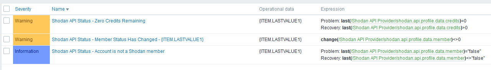
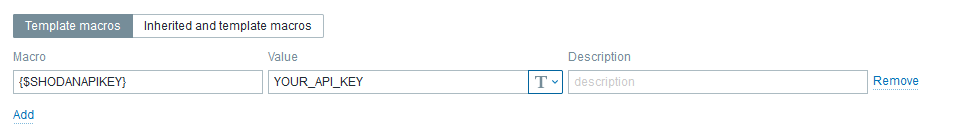
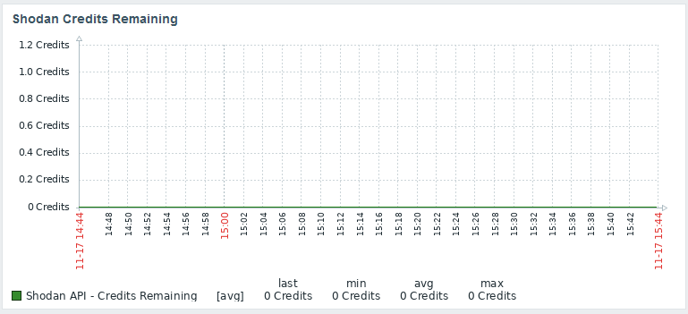
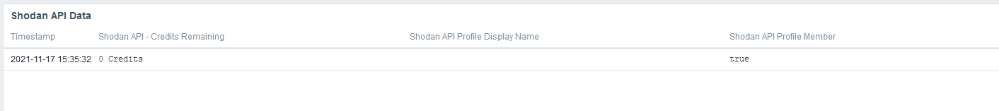

# Zabbix_Shodan-APIStatus
Zabbix Template for Shodan.io API account usage. Provides account info and API usage.

## Installation
- Import Zabbix_Shodan-APIStatus.yaml (Zabbix Template)
- Create Zabbix host
- Link new Zabbix Template "Shodan API Provider"
- Set macro "{$SHODANAPIKEY}" to your Shodan API Key
- Add agent interface (its necessary for the HTTP Agent to work, despite an actual "host" not being necessary.)

## Items
- Shodan API Profile Member (should be true if paid)
- Shodan API Profile Display Name
- Shodan API Credits Remaining

## Triggers
- Credits has reached zero
- Change in account status
- Account status is inactive

## Macros
- {$SHODANAPIKEY} (Your Shodan API Key)

## Tags 
- Application:API
- API:Shodan
- Application:Shodan
- Shodan:data (API JSON Data Source)
- Shodan:Used (Credits Used)
- Shodan:Account (Account Information)

## Screenshots

Template Triggers

Template Macros

Dashboard - Credits Remaining

Dashboard - Account Information

## Known Issues
- Credits Used is not available as an API endpoint.  I will, at some point use a calculated item to generate this without the API endpoint.

## Updates
- Nov 17 2021 - Added tags, added export format

## Contact
Twitter: @KRelkci
GitHub: @Relkci

## Special Thanks
Black Hills Information Security
https://www.blackhillsinfosec.com
